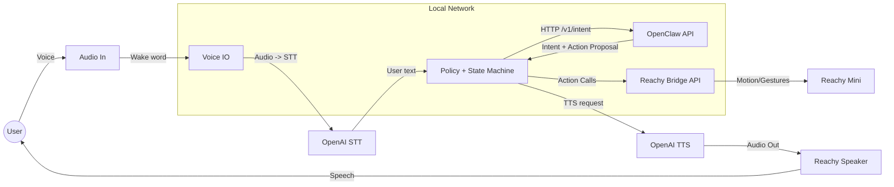

# dobby-the-claw

Bridge project for Reachy Mini + OpenClaw.

## Overview

- OpenClaw is the cognitive brain (API local).
- Reachy Mini is the physical body and voice.
- This bridge enforces the behavior spec and action safety policy.

See the behavior spec in [docs/behavior-spec-v1.md](docs/behavior-spec-v1.md).

## Architecture

The bridge is the coordination layer between OpenClaw (cognition) and Reachy Mini (body/voice).
It owns the state machine, safety policy, and IO orchestration.



Key responsibilities:

- State machine transitions and timeouts (IDLE/LISTENING/THINKING/EXECUTING/CONFIRMING/ERROR).
- Action class policy enforcement (A/B/C/D) before any execution.
- Voice pipeline (wake word, STT, TTS) and interrupt handling.
- Reachy motion/gesture orchestration via reachy-bridge API.

## Quick Start (Docker)

1. Copy .env.example to .env and fill values.
2. Run:

```bash
docker compose up --build
```

For Raspberry profile (optional limits):

```bash
docker compose -f docker-compose.yml -f docker-compose.rpi.yml up --build
```

## Project Structure

- [src/bridge](src/bridge): bridge code (state machine, clients, voice).
- [docs/architecture.md](docs/architecture.md): architecture draft.
- [docs/api-contract.md](docs/api-contract.md): message contract draft.
