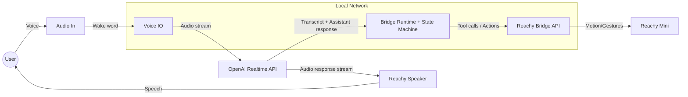

# dobby-the-claw

Bridge project for Reachy Mini + OpenClaw.

## Overview

- Runtime today: OpenAI Realtime API is the active conversation brain (LLM + streaming audio).
- Reachy Mini is the physical body and voice.
- OpenClaw integration is planned, but not implemented yet.

See the behavior spec in [docs/behavior-spec-v1.md](docs/behavior-spec-v1.md).

## Architecture

The bridge is the coordination layer between OpenAI Realtime (conversation) and Reachy Mini (body/voice).
It owns state transitions, low-latency IO orchestration, and tool calls.



Key responsibilities:

- State machine transitions and timeouts (IDLE/LISTENING/THINKING/EXECUTING/CONFIRMING/ERROR).
- Voice pipeline with OpenAI Realtime (input transcription + output audio) and interrupt handling.
- Reachy motion/gesture orchestration via reachy-bridge API.
- Tool execution routing (for example, camera snapshot tool).

## Current Status

- ✅ Implemented: Realtime voice loop with OpenAI Realtime API.
- ✅ Implemented: Reachy SDK/bridge actions and gesture orchestration.
- 🚧 Planned: OpenClaw `/v1/intent` integration.

## Quick Start (Docker)

1. Copy .env.example to .env and fill values.
2. Run:

```bash
docker compose up --build
```

For Raspberry profile (optional limits):

```bash
docker compose -f docker-compose.yml -f docker-compose.rpi.yml up --build
```

## Project Structure

- [src/bridge](src/bridge): bridge code (state machine, clients, voice).
- [docs/architecture.md](docs/architecture.md): architecture draft.
- [docs/api-contract.md](docs/api-contract.md): message contract draft.
