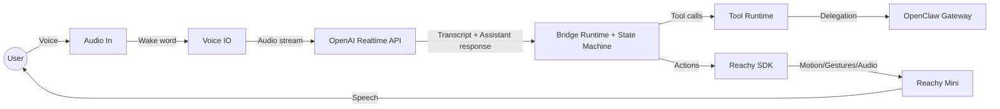

# dobby-the-claw

Bridge project for Reachy Mini + OpenAI Realtime + OpenClaw delegation.

## Overview

- Runtime conversation brain: OpenAI Realtime API (live transcription + streamed assistant audio).
- Physical embodiment: Reachy Mini (SDK path active with `REACHY_BRIDGE_URL=sdk`).
- Delegation path: OpenClaw gateway tool for complex or longer-running tasks.

See behavior expectations in [docs/behavior-spec-v1.md](docs/behavior-spec-v1.md).

## Architecture

The bridge is the orchestration layer between user speech, OpenAI Realtime, Reachy embodiment, and optional OpenClaw delegation.


```mermaid
flowchart LR
    user((User)) -->|Voice| mic[Audio In]
    mic -->|Wake word| voice[Voice IO]
    voice -->|Audio stream| rt[OpenAI Realtime API]
    rt -->|Transcript + Assistant response| bridge[Bridge Runtime + State Machine]
    bridge -->|Tool calls| tools[Tool Runtime]
    tools -->|Delegation| oc[OpenClaw Gateway]
    bridge -->|Actions| reachy[Reachy SDK]
    reachy -->|Motion/Gestures/Audio| hw[Reachy Mini]
    hw -->|Speech| user
```

Key responsibilities:

- Event-driven state transitions (`IDLE/LISTENING/THINKING/DELEGATING/EXECUTING/CONFIRMING/ERROR`).
- Voice pipeline with OpenAI Realtime (input transcription + output audio) and interruptions.
- Reachy motion/gesture orchestration through SDK client path.
- Tool execution routing (`camera_snapshot`, `openclaw_delegate`).

## Current Status

- ✅ Implemented: Realtime voice loop with OpenAI Realtime API.
- ✅ Implemented: Reachy SDK actions + motion orchestration.
- ✅ Implemented: OpenClaw delegation tool via local gateway WebSocket.
- 🚧 Planned: non-SDK Reachy bridge HTTP client path.

## Quick Start (Docker)

1. Copy `.env.example` to `.env` and fill values.
2. Run:

```bash
docker compose up --build
```

For Raspberry profile:

```bash
docker compose -f docker-compose.yml -f docker-compose.rpi.yml up --build
```

## Quick Start (Local)

With virtualenv active and `.env` configured:

```bash
python -m bridge.main --mode realtime
```

Text chat mode (assistant still outputs audio via Reachy):

```bash
python -m bridge.main --mode chat
```

Optional flags:

```bash
python -m bridge.main --mode realtime --no-headtracking
python -m bridge.main --mode realtime --idle-sleep-timeout-s 300
```

## Project Structure

- [src/bridge](src/bridge): bridge code (state machine, clients, tools, runtime).
- [src/bridge/runtime/orchestrator.py](src/bridge/runtime/orchestrator.py): runtime orchestration core.
- [src/bridge/runtime/ports.py](src/bridge/runtime/ports.py): runtime port contracts.
- [src/bridge/runtime/adapters](src/bridge/runtime/adapters): infra adapters (Realtime, Reachy, OpenClaw gateway, tools).
- [docs/architecture.md](docs/architecture.md): architecture notes.
