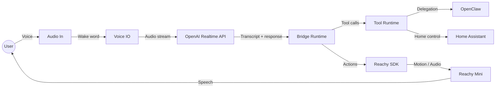

# dobby-the-claw

An orchestration bridge that brings **Dobby** to life — a sharp-witted, sarcastic AI assistant embodied in a [Reachy Mini](https://www.pollen-robotics.com/reachy-mini/) robot. Dobby speaks Brazilian Portuguese by default, reacts to voice commands, controls smart home devices, and can delegate complex tasks to a secondary AI agent (OpenClaw).

```
User → voice → OpenAI Realtime API → Bridge → Reachy Mini (motion, gestures, speech)
                                             → OpenClaw (complex task delegation)
                                             → Home Assistant (smart home control)
```

## Features

- **Realtime voice conversation** via OpenAI Realtime API — low latency, streaming audio, interruption support
- **Physical embodiment** — Reachy Mini gestures, head tracking, antenna expressions, camera vision
- **Wake word detection** — robot sleeps when idle and wakes on "Dobby" (offline, via openWakeWord)
- **Smart home control** — discovers and controls Home Assistant devices via voice
- **Task delegation** — offloads complex or long-running tasks to OpenClaw
- **Finger-to-antenna control** — index fingers mapped to antenna angles via MediaPipe

## Requirements

**Hardware**
- [Reachy Mini](https://www.pollen-robotics.com/reachy-mini/) with its daemon running (see [Raspberry Pi setup](docs/raspberry-integration.md))

**Software**
- Python 3.11
- OpenAI API key with Realtime API access

## Setup

### 1. Clone and create virtualenv

```bash
git clone https://github.com/your-org/dobby-the-claw.git
cd dobby-the-claw
python -m venv .venv
source .venv/bin/activate        # Windows: .venv\Scripts\activate
pip install -r requirements.txt
```

### 2. Configure environment

```bash
cp .env.example .env
```

Edit `.env` and fill in at minimum:

| Variable | Description |
|---|---|
| `OPENAI_API_KEY` | Your OpenAI API key |
| `REACHY_BRIDGE_URL` | `sdk` to connect via Reachy SDK (default) |

For optional integrations:

| Variable | Description |
|---|---|
| `OPENCLAW_BEARER_TOKEN` | Token from OpenClaw setup |
| `HOME_ASSISTANT_URL` | Home Assistant base URL (ex.: `http://127.0.0.1:8123`) |
| `HOME_ASSISTANT_TOKEN` | Long-lived token from HA profile |
| `WAKEWORD_MODEL_PATH` | Path to custom wake word `.onnx` model (see below) |

Full reference in [`.env.example`](.env.example).

### 3. Train the wake word model (optional but recommended)

By default, Dobby wakes on any speech (RMS energy fallback). For precise "Dobby" detection, train a custom [openWakeWord](https://github.com/dscripka/openWakeWord) model.

The easiest path is the **official Colab notebook**, which handles all dependencies and data generation:

1. Open the [openWakeWord training notebook](https://colab.research.google.com/drive/1q1oe2zOyZp7UsB3jJiQ1IFn8z5YfjwEb?usp=sharing) in Google Colab
2. Set `target_phrase = "dobby"`
3. Run all cells (~15–30 min on Colab GPU)
4. Download the generated `.onnx` file
5. Place it at `models/wakeword/dobby.onnx`
6. Set in `.env`:

```env
WAKEWORD_MODEL_PATH=../models/wakeword/dobby.onnx
```

7. Download the openWakeWord feature extraction models (required once, ~5 MB):

```bash
python -c "import openwakeword.utils; openwakeword.utils.download_models([])"
```

For a fully local training setup, see the [openWakeWord training docs](https://github.com/dscripka/openWakeWord/blob/main/docs/training.md).

### 4. Run

```bash
PYTHONPATH=src python -m bridge.main --mode realtime
```

Text-only mode (no microphone needed, Reachy still moves and speaks):

```bash
PYTHONPATH=src python -m bridge.main --mode chat --no-headtracking
```

## Raspberry Pi Deployment

The Reachy Mini daemon runs natively on a Raspberry Pi 4 (8 GB RAM). The bridge can run locally and connect to the Pi via SSH tunnels.

```bash
# Open all tunnels (Reachy SDK, OpenClaw, Home Assistant)
./scripts/tunnel.sh

# Stop tunnels
./scripts/tunnel.sh stop
```

Full setup guide: [docs/raspberry-integration.md](docs/raspberry-integration.md)

## Architecture

See [docs/architecture.md](docs/architecture.md) for a full breakdown of components, state machine, data flow, and ports & adapters design.


```mermaid
flowchart LR
    user((User)) -->|Voice| mic[Audio In]
    mic -->|Wake word| voice[Voice IO]
    voice -->|Audio stream| rt[OpenAI Realtime API]
    rt -->|Transcript + response| bridge[Bridge Runtime]
    bridge -->|Tool calls| tools[Tool Runtime]
    tools -->|Delegation| oc[OpenClaw]
    tools -->|Home control| ha[Home Assistant]
    bridge -->|Actions| reachy[Reachy SDK]
    reachy -->|Motion / Audio| hw[Reachy Mini]
    hw -->|Speech| user
```

## Configuration Reference

Key environment variables (full list in `.env.example`):

| Variable | Default | Description |
|---|---|---|
| `REACHY_BRIDGE_URL` | `sdk` | `sdk` for local SDK connection |
| `REALTIME_MODEL` | `gpt-realtime` | OpenAI Realtime model |
| `STT_LANGUAGE` | `pt` | Speech recognition language |
| `IDLE_SLEEP_TIMEOUT_S` | `300` | Seconds of silence before sleep |
| `OFFLINE_WAKEWORD_ENABLED` | `1` | Enable wake word / RMS fallback |
| `WAKEWORD_MODEL_PATH` | _(empty)_ | Custom openWakeWord `.onnx` model path |
| `HOME_ASSISTANT_ENABLED` | `0` | Enable Home Assistant integration |
| `OPENCLAW_ENABLED` | `1` | Enable OpenClaw task delegation |

## Development

**Lint / format:**
```bash
ruff check .
ruff format .
```

No automated test suite — validation is done by running the bridge in `chat` mode.

**VS Code:** launch configurations for both `realtime` and `chat` modes are in `.vscode/launch.json`.
