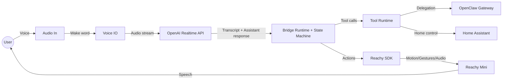

# dobby-the-claw

Bridge project for Reachy Mini + OpenAI Realtime + OpenClaw delegation + Home Assistant control.

## Overview

- Runtime conversation brain: OpenAI Realtime API (live transcription + streamed assistant audio).
- Physical embodiment: Reachy Mini (SDK path active with `REACHY_BRIDGE_URL=sdk`).
- Delegation path: OpenClaw gateway tool for complex or longer-running tasks.
- Home automation path: Home Assistant WebSocket tools for discovery and action execution.

See behavior expectations in [docs/behavior-spec-v1.md](docs/behavior-spec-v1.md).

## Architecture

The bridge is the orchestration layer between user speech, OpenAI Realtime, Reachy embodiment, and optional OpenClaw delegation.


```mermaid
flowchart LR
    user((User)) -->|Voice| mic[Audio In]
    mic -->|Wake word| voice[Voice IO]
    voice -->|Audio stream| rt[OpenAI Realtime API]
    rt -->|Transcript + Assistant response| bridge[Bridge Runtime + State Machine]
    bridge -->|Tool calls| tools[Tool Runtime]
    tools -->|Delegation| oc[OpenClaw Gateway]
    tools -->|Home control| ha[Home Assistant]
    bridge -->|Actions| reachy[Reachy SDK]
    reachy -->|Motion/Gestures/Audio| hw[Reachy Mini]
    hw -->|Speech| user
```

Key responsibilities:

- Event-driven state transitions (`IDLE/LISTENING/THINKING/DELEGATING/EXECUTING/CONFIRMING/ERROR`).
- Voice pipeline with OpenAI Realtime (input transcription + output audio) and interruptions.
- Reachy motion/gesture orchestration through SDK client path.
- Tool execution routing (`camera_snapshot`, `delegate_task`, `go_to_sleep`, `discover_home_devices`, `control_home_device`, `dance`).
- Runtime instruction guardrails aggregated from tool metadata (`runtime_guardrail`).

## Home Assistant Tools

- `discover_home_devices`: lists entities and available services (optionally filtered by domain).
- `control_home_device`: executes a device action (`domain.service`) on selected targets.
- Sensitive domains require explicit confirmation via the `confirmed=true` argument.

## Sleep Tool

- `go_to_sleep`: puts Reachy into sleep mode and waits for the wake word.


## Quick Start (Docker)

1. Copy `.env.example` to `.env` and fill values.
2. Run:

```bash
docker compose up --build
```

For Raspberry profile:

```bash
docker compose -f docker-compose.yml -f docker-compose.rpi.yml up --build
```

## Quick Start (Local)

With virtualenv active and `.env` configured:

```bash
python -m bridge.main --mode realtime
```

Text chat mode (assistant still outputs audio via Reachy):

```bash
python -m bridge.main --mode chat
```

Optional flags:

```bash
python -m bridge.main --mode realtime --no-headtracking
python -m bridge.main --mode realtime --idle-sleep-timeout-s 300
```

## Vision Antenna Finger Control

When MediaPipe is available, the camera worker can map raised index fingers to antennas:

- 1 raised index finger: both antennas follow that finger lift.
- 2 raised index fingers (one per hand): each antenna follows one finger independently.
- While finger control is active, antenna breathing sway is overridden.

Environment tuning:

- `ANTENNA_FINGER_TRACKING_ENABLED=1` enables/disables this feature.
- `ANTENNA_FINGER_MAX_ANGLE_DEG=180.0` keeps the example-style orientation mapping effectively unclipped.

## Project Structure

- [src/bridge](src/bridge): bridge code (state machine, clients, tools, runtime).
- [src/bridge/runtime/orchestrator.py](src/bridge/runtime/orchestrator.py): runtime orchestration core.
- [src/bridge/runtime/ports.py](src/bridge/runtime/ports.py): runtime port contracts.
- [src/bridge/runtime/adapters](src/bridge/runtime/adapters): infra adapters (Realtime, Reachy, OpenClaw gateway, tools).
- [docs/architecture.md](docs/architecture.md): architecture notes.
